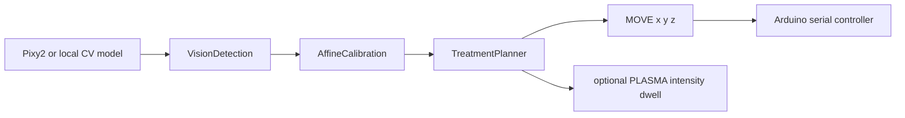

# Host CV Planner

The host planner converts camera detections into robot-safe command plans without embedding camera logic in Arduino firmware.



## Contracts

- `VisionDetection`: centroid, area, and confidence from Pixy2, classical CV, or a future local model.
- `AffineCalibration`: pixel-to-mm transform. Start with scale/offset, then upgrade to multi-point affine calibration when lab calibration points are collected.
- `PlasmaPolicy`: conservative intensity/dwell mapping. Low-confidence detections produce zero plasma output.
- `AegisSerialClient`: sends `HOME`, `MOVE`, `STATUS`, and optional `PLASMA` commands. Plasma is disabled by default.

## Example

```bash
python -m host.aegis_control.cli detections.csv \
  --x-mm-per-px 0.5 --y-mm-per-px 0.5 \
  --x-offset-mm 10 --y-offset-mm 12 --emit-plasma
```

Input CSV columns: `centroid_x_px,centroid_y_px,area_px2,confidence`.

## Safety posture

The first robot test should run motion-only, without `--emit-plasma`. Only enable plasma after homing, travel limits, standoff, STOP behavior, and thermal safety are validated.
