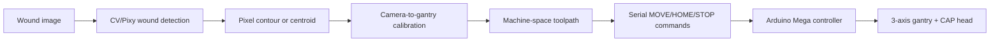

# AEGIS Wound-to-Coordinate Control Architecture

This repo now separates the robot into three layers:

1. **Perception**: camera or Pixy2 detects wound geometry in image space.
2. **Calibration**: image pixels are transformed into gantry millimeters.
3. **Actuation**: Arduino firmware receives machine-space commands and moves the gantry.

## Data flow



## Coordinate frames

| Frame | Units | Origin | Owner |
|------|-------|--------|-------|
| Image | pixels | camera image top-left | CV / Pixy2 |
| Machine | millimeters | homed gantry origin | host planner |
| Motor | steps | homed stepper zero | Arduino firmware |

The Arduino should not know camera geometry. It only accepts calibrated machine
coordinates. That keeps vision/planning easy to iterate on without reflashing the
robot for every camera or treatment change.

## Serial firmware protocol

The initial controller in `firmware/aegis_controller/main.cpp` exposes a small
line-based protocol at 115200 baud:

| Command | Meaning |
|---------|---------|
| `HOME` | Home Z, then X, then Y using limit switches. |
| `MOVE <x_mm> <y_mm> <z_mm>` | Move to a clamped machine-space target. |
| `STOP` | Immediately hold the current target position. |
| `STATUS` | Print current step positions. |

Example:

```text
HOME
MOVE 20.0 35.0 4.0
STATUS
STOP
```

## Host-side planner contract

The next software layer should generate commands from wound geometry:

1. Detect wound contour or bounding polygon in image pixels.
2. Apply calibrated camera-to-machine transform.
3. Generate a conservative raster or contour-following toolpath in millimeters.
4. Assign CAP intensity/dwell time per waypoint based on wound area, distance,
   and safety limits.
5. Stream `MOVE` commands only after homing and a valid `STATUS` response.

## Safety notes

- Treat the constants in `firmware/aegis_controller/main.cpp` as placeholders
  until the lead screw pitch, microstepping, and travel limits are measured.
- Keep CAP disabled by default until the motion-only loop is validated.
- Add an external emergency stop before unattended tests.
- Verify limit switch polarity on the real robot before homing at speed.
